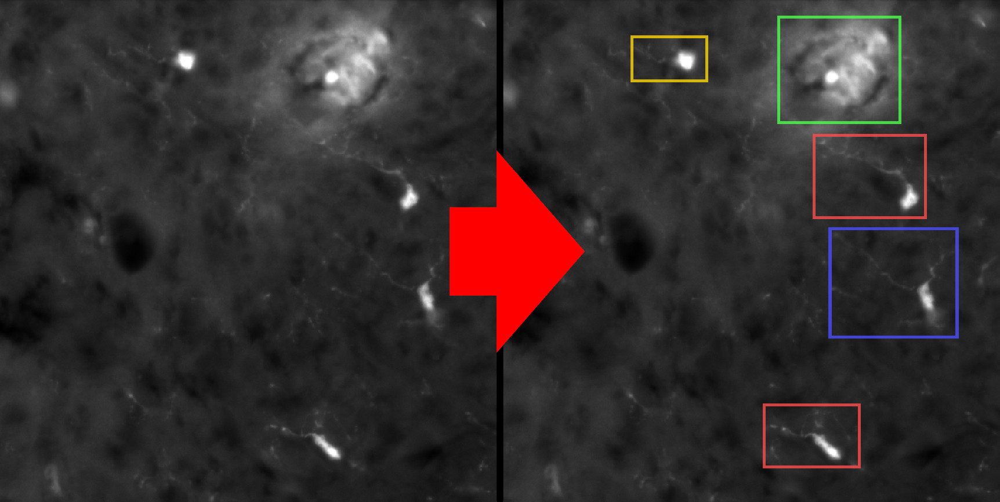

===========================
Annotate your data for YOLO
===========================

- The goal of this widget is to help you annotate your data for the YOLO model.
- YOLO is a deep learning model that can detect objects in images.
- Detections are composed of bounding-boxes around objects and a class label.
- To train the model, you need to provide a dataset of annotated images.
- The widget "YOLO Annotator" will help you to create this dataset.

1. Prepare your data
====================

- First of all, the data that you will annotate must be ready.
- Your images must all be the same size in pixels.
- You can use TIF, PNG, JPG, ... but no proprietary format (CZI, LIF, ...).
- You can use the "Tiles creator" widget to create patches from your images. A common size is 512x512 pixels.
- All the images that you want to annotate must be in the same folder.
- Before you start, you should have a folder structure like this:

.. code-block:: bash

   📁 some-folder
   ├── 📁 my-experiment
   │   ├── 14-25-23.336.tif
   │   ├── 14-25-23.379.tif
   │   ├── ...
   │   └── 14-25-36.949.tif

2. Initialize the widget
========================

- Open the widget located in: Plugins > Microglia Analyzer > YOLO Annotator.
- Click the "Root folder" button and choose the folder named "some-folder" in the previous example. It is the folder containing the folder in which your images are located.
- In the "Inputs sub-folder" dropdown menu, choose the folder named "my-experiment" in the previous example. It is the folder containing your images.
- The first image of your experiment will be displayed.
- You can navigate through the images using the dropdown menu in the "Annotations management" section.

3. Create your classes
======================

- The first thing to do is to create new classes. Each one corresponds to a different type of object that you want to detect.
- Simply fill the text field in the "Classes management" section and click the "New class" button.
- You can add as many classes as you want.
- The classes that you add should appear in the layers stack of Napari (on the left side of the window).

4. Annotate your data
=====================

- To annotate an object, you have to draw a bounding-box around it. You are limited to rectangles. Do not use ellipses or polygons or anything else.
- You can choose the rectangle tool in the upper-left section of the Napari's window.
- Your boxes should contain the whole object and a few pixels around it.
- It is not a problem if the boxes overlap.
- If you failed a box, don't edit it: delete it and draw a new one.
- If you don't plan to annotate many images, you should really be careful not to forget any object on your images.
- When you are happy with the annotations you made, click the "Save annotations" button in the "Annotations management" section.
- In the "Classes management" section, a table should have appeared to show you global statistics about your annotations. 
- A new folder with the "-labels" suffix should have appeared in the root folder. It contains the annotations you made.
- A new file with the "-classes.txt" suffix should have appeared in the root folder. It contains the classes you created.
- Your files architecture should now look like this:

.. code-block:: bash

   📁 some-folder
   ├── 📁 my-experiment
   │   ├── 14-25-23.336.tif
   │   ├── 14-25-23.379.tif
   │   ├── ...
   │   └── 14-25-36.949.tif
   ├── 📁 my-experiment-labels
   │   ├── 14-25-23.336.txt
   │   ├── 14-25-23.379.txt
   │   ├── ...
   │   └── 14-25-36.949.txt
   ├── 📃 my-experiment-classes.txt

Notes
=====

- If you are working on RGB images, they will be converted to grayscale.
- If you already annotated some images, your annotations will be loaded when you open the widget.
- Whenever it is possible, try to have a balanced dataset. It means that you should have the same number of annotations for each class.
- In the ".txt" files generated for each image by the widget, the content is as follows:
   - [integer]: the class index (starting from 0).
   - [float]: the x-coordinate of the center of the bounding-box, in percentage of the image width.
   - [float]: the y-coordinate of the center of the bounding-box, in percentage of the image height.
   - [float]: the width of the bounding-box, in percentage of the image width.
   - [float]: the height of the bounding-box, in percentage of the image height.