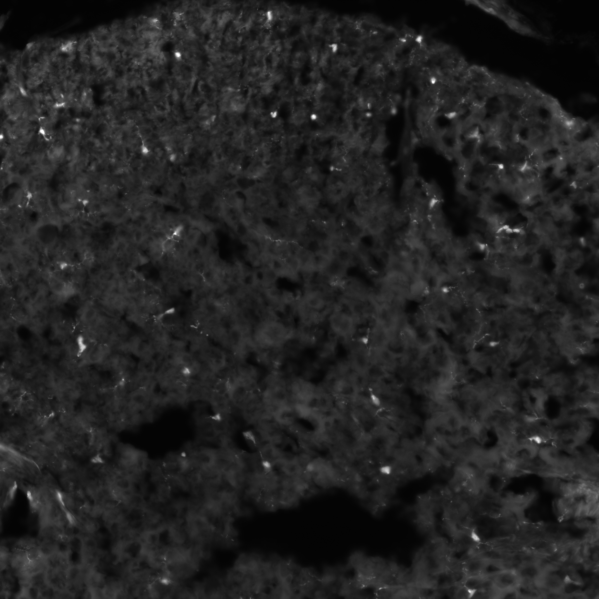

==============================
Patches from calibrated images
==============================

Whether it is for the segmentation (UNet2D) or the classification (YOLOv5), the models use patches of 512×512 pixels as inputs.
As a model expects an input of a precise size, cutting images allows to accept images of any size.
Also, a model taking a whole image as input would be too slow and would require too much memory.
In this section, we will explain how to cut your images in patches if you ever need to retrain either model.

⚠️ Note that cutting patches manually is only required if you want to retrain the models. If you just want to use the plugin, you can skip this section. Cutting and merging patches is done automatically by the plugin.

Before starting, you should have all the images that you want to cut in the same folder.
At this point, you can open the widget: Microglia Analyzer > Tiles Creator.

1. Open your images (Media control)
===================================

- The first step is to click on the :code:`Load` button and navigate to the folder containing your images.
- You can get a global overview of your images by clicking on the :code:`Show sample` button. It will take up to 25 random elements and assemble them into a mosaic.
- The number of images detected in the folder shoud be displayed in the "sources" field.
- If all images have the same size, the "Shape" field should display it.

2. Recalibration (Calibration)
==============================

Models are usually made to work with images having a given pixel size.
For example, the current models were trained to work with images having a pixel size of 0.325 µm.
If your images have a different pixel size, you can still find a way around this problem by artificially changing the pixel size of your images.
It simply consists in scaling your images so that they have the same pixel size as the one the model was trained on.

.. table:: An object of 20µm of diameter with different pixel sizes
   :align: center

   +----------------------------------------------------+-------------------------------------------------------------+--------------------------------------------------------------+
   | .. image:: _images/calibration/calibration-1.png   | .. image:: _images/calibration/calibration-1-psize0_9.png   | .. image:: _images/calibration/calibration-1-psize0_65.png   |
   |   :height: 250px                                   |   :height: 250px                                            |   :height: 250px                                             |
   |   :width: 250px                                    |   :width: 250px                                             |   :width: 250px                                              |
   |   :align: center                                   |   :align: center                                            |   :align: center                                             |
   +----------------------------------------------------+-------------------------------------------------------------+--------------------------------------------------------------+
   | The object is always 20µm of diameter              | Pixel size = 0.9µm                                          | Pixel size = 0.65µm                                          |
   +----------------------------------------------------+-------------------------------------------------------------+--------------------------------------------------------------+

3. Normalize the values (Normalization)
=======================================

- Inference relies on the values contained in the images. If your first batch of images have a range of 279-56363 and the second one 0-1, the model will not be able to make any sense of it.
- The goal of this step is to make sure that all images have the same range of values.
- Also, models usually deal better with small values rather than huge ones.
- Our goal here will be to make our batches of images more uniform for the models to have the same "reaction" to them.
- For a quicker explanation, from now on, we will say that we want to normalize the images between 0 and 1 on 32-bits.
- The normalization here is based on "histogram stretching", it means that the minimal and maximal values found will be bound to 0 and 1 respectively. The values in between will be stretched accordingly.

a. Type of normalization
------------------------

- The patches can be either normalized locally or globally.
- In the case of local normalization, the minimal and maximal values will be computed for each patch. So even a patch containing only noise will have its values stretched between 0 and 1. It will increase the importance of noise.
- In the case of global normalization, the minimal and maximal values will be computed for the whole image. So a region containing only low values will remain an area of low values after stretching, compared to other regions.

.. table:: Two patches of the same regions with local vs. global normalization
   :align: center

   +----------------------------------------------------+----------------------------------------------------------------------------------+--------------------------------------------------------------------------------+
   | .. image:: _images/normalization/input.png         | .. image:: _images/normalization/global-noise.png                                | .. image:: _images/normalization/local-noise.png                               |
   |   :align: center                                   |   :align: center                                                                 |   :align: center                                                               |
   +----------------------------------------------------+----------------------------------------------------------------------------------+--------------------------------------------------------------------------------+
   | Image on 16-bits with value in the range 662-62333 | GLOBAL normalization: The first with values in 0.0-1.0 and the other in 0.0-0.04 | LOCAL normalization: The first with values in 0.0-1.0 and the other in 0.0-1.0 |
   +----------------------------------------------------+----------------------------------------------------------------------------------+--------------------------------------------------------------------------------+

b. Target bounds
----------------

- The target bounds are the values that will be used to stretch the values.
- It will most likely be between 0 and 1, but you can choose any other range if you want.

c. Output type
--------------

- Depending on your target bounds, will be constrained to a certain type of data.
- For example:
   - If you need to export your values between 0.0 and 1.0, you can only use the :code:`float32` type.
   - If you need to export your values between 0 and 255, you can use the :code:`uint8`, :code:`uint16` or :code:`float32` types.
   - If you need to export your values between 0 and 65535, you can use the :code:`uint16` or :code:`float32` types.

d. Output format
----------------

- Depending on where you want to use your patches, and the data-type of your patches, you will have to use a certained file-format.
- For example:
   - You can use any file format to store :code:`uint8` data.
   - You can use :code:`.tif` to store any type of data.
   - You can use :code:`.jpg` to store :code:`uint8` data (even though you should never use this data type except to make images for your slides or presentations).

e. Conclusion
-------------

- If you need to retrain your UNet, you need to export patches as :code:`float32` in :code:`.tif` format, between 0.0 and 1.0.
- If you need to retrain your YOLO, you need to export patches as :code:`uint8` in :code:`.png` format, between 0 and 255.

4. Tiles Settings (Tiles Configuration)
=======================================

- Our goal will be to cut our images in tiles having all the same size, so the models can get a fixed-size input.
- The size of the tiles is set to 512×512 pixels by default because it is the size we used to train both our models.
- Another setting is the overlap between tiles. It is set to 128 by default. It means that each tile will overlap the previous one by 128 pixels. It is very important in the case of filamentous structures as the lack of contiuous context could create cuts in the structures (see example below).

+------------------------------------------------------+-------------------------------------------------+
| .. image:: _images/patches/proba-no-overlap.png      | .. image:: _images/patches/mask-no-overlap.png  |
|   :align: center                                     |   :align: center                                |
+------------------------------------------------------+-------------------------------------------------+
| Probability map of segmented patches without overlap | Mask of segmented patches without overlap       |
+------------------------------------------------------+-------------------------------------------------+

- The overlap is automatically increased if the tiles are too close to the border of the image, to reach 512×512 pixels patches. The overlap is only increased on the last patches in this case.
- Right below, you can observe the way patches are cut with overlap.

- You can now click on the :code:`Preview tiles` button to get a preview of the cutting pattern on an image from your folder.
- You can use the slider below to see the different patches one by one.
- Alternatively, you can use the checkbox "Show all tiles" to see all the patches at once.

5. Export the patches (Export Configuration)
============================================

- In this block, you have only 3 buttons:
   - :code:`Select export folder` will ask you for an empty folder in which the patches will be exported.
   - :code:`Empty export folder` to remove everything present in the folder you selected.
   - :code:`Export tiles` to launch the conversion of all the images from your input folder to patches in the output folder.