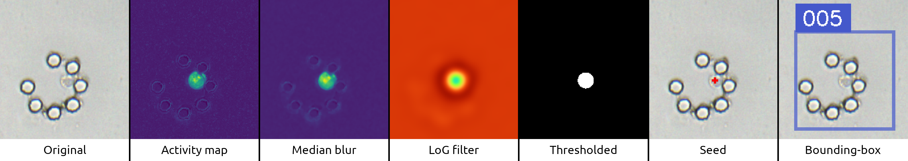
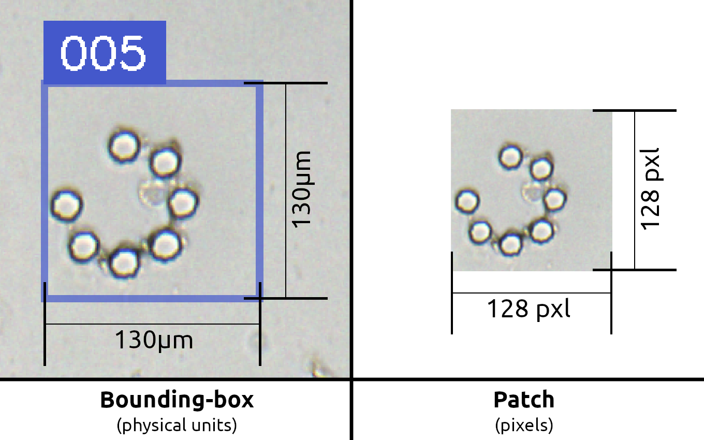

.. _make_patches: 

==============================
Patches from calibrated images
==============================

1. Detect the protoplasts
=========================

A single experiment is 20 GB of size in average. We would like not to waste processing time to launch the segmentation of traps that are actually empty.
To do so, we implemented a way to detect the presence of protoplasts (find their centroïd).

The first step of the algorithm consists in processing the "activity map" of this experiment. By this, we mean the areas where protoplasts are spinning on themselves. 

This is achieved by summing the absolute difference between each contiguous pairs of frame.

Then, we apply a sequence of filters (Median blur, Laplacian of Gaussian, threshold et connected components labeling) to find a little spot of pixels per protoplast. We finish this step with a points-set containing one point on each protoplast.

2. Create the patches
=====================

For a model to predict correctly objects, the patches you feed it must be similar to the ones it was trained with.

The model we trained requires patches that are exactly 128×128 pixels of size.
It sounds like a big constraint as it implies that your pixel size should always be the same.
Indeed, if we cut a patch of 128×128 pixels, those 128 pixels are 115.2 µm if the size of a pixel is 0.9 µm and they are only 76.8 µm if a pixel is 0.65 µm.

We addressed this problem by doing a two-step patches extraction.

Instead of cutting patches of 128×128 pixels in the main image, we cut patches of 130×130 µm, whatever size in pixels it is.
Once we have those patches, we re-sample them by scaling them so they can fit in a 128×128 pixels image.

.. table:: An object of 20µm of diameter with different pixel sizes
   :align: center

   +----------------------------------------------------+-------------------------------------------------------------+--------------------------------------------------------------+
   | .. image:: _images/calibration/calibration-1.png   | .. image:: _images/calibration/calibration-1-psize0_9.png   | .. image:: _images/calibration/calibration-1-psize0_65.png   |
   |   :height: 250px                                   |   :height: 250px                                            |   :height: 250px                                             |
   |   :width: 250px                                    |   :width: 250px                                             |   :width: 250px                                              |
   |   :align: center                                   |   :align: center                                            |   :align: center                                             |
   +----------------------------------------------------+-------------------------------------------------------------+--------------------------------------------------------------+
   | The object is always 20µm of diameter              | Pixel size = 0.9µm                                          | Pixel size = 0.65µm                                          |
   +----------------------------------------------------+-------------------------------------------------------------+--------------------------------------------------------------+

3. Export the patches
=====================

The patches are exported in 128×128 pixels, on 32 bits, normalized between 0 and 1.
