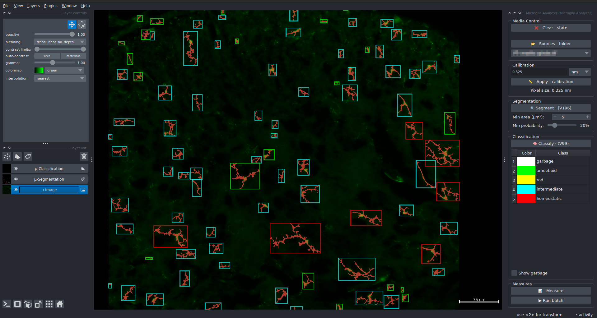

=========================
Quick start: A user guide
=========================

1. Introduction
===============

- "Microglia Analyzer" is a Python module allowing to segment, classify and measure microglia from 2D fluo images.
- This module is also a Napari plugin in case you would need a graphical interface.
- The segmentation produced doesn't allow to recover the actual surface of microglia since the output of the segmentation is a shape optimized for skeletonization.
- Each cell is classified according 3 classes: "amoeboid", "intermediate" and "homeostatic".
- The measures (bundled in a CSV file by the end) include:
   - The total length of each cell
   - The number of junctions for each cell
   - The number of leaves for each cell
   - The average branch length for each cell
- From the GUI (Napari), a batch mode is available allowing you run the whole workflow over an entire folder.

2. Install the plugin 
=====================

- We strongly recommand to use `conda <https://docs.conda.io/en/latest/miniconda.html>`_ or any other virtual environment manager instead of installing Napari and microglia-analyzer in your system's Python.
- Napari is only required if you want to use microglia-analyzer with a graphical interface.
- Napari is not part of microglia-analyzer's dependencies, so you will have to install it separately.
- Each of the commands below is supposed to be ran after you activated your virtual environment.
- If the install was successful, you should see the plugin in Napari in the top bar menu: Plugins > Microglia Analyzer > Microglia Analyzer.

A. Development versions
-----------------------

+-----------------------+------------------------------------------------------------------------------------------------------------------------------------------------------------------------------------------+
| Method                | Instructions                                                                                                                                                                             |
+=======================+==========================================================================================================================================================================================+
| pip                   | :code:`pip install git+https://github.com/MontpellierRessourcesImagerie/microglia-analyzer.git`                                                                                          |
+-----------------------+------------------------------------------------------------------------------------------------------------------------------------------------------------------------------------------+
| GitHub                | :code:`pip install git+https://github.com/MontpellierRessourcesImagerie/microglia-analyzer.git`.                                                                                         |
+-----------------------+------------------------------------------------------------------------------------------------------------------------------------------------------------------------------------------+
| From an archive       | - Download `the archive <https://github.com/MontpellierRessourcesImagerie/microglia-analyzer/archive/refs/heads/main.zip>`_  :code:`pyproject.toml` and launch :code:`pip install -e .`. |
|                       | - From the terminal containing your virtual env, move to the folder containing the file :code:`pyproject.toml`                                                                           |
|                       | - Run the command :code:`pip install -e .`                                                                                                                                               |
+-----------------------+------------------------------------------------------------------------------------------------------------------------------------------------------------------------------------------+

B. Stable versions
------------------

+-----------------------+------------------------------------------------------------------------------------+
| Method                | Instructions                                                                       |
+=======================+====================================================================================+
| pip                   | Activate your conda environment, and type :code:`pip install microglia-analyzer`.  |
+-----------------------+------------------------------------------------------------------------------------+
| NapariHub             | Go in the plugins menu of Napari and search for "Microglia Analyzer"               |
+-----------------------+------------------------------------------------------------------------------------+

3. Notes 
========

- The plugin provides detailed output, so it's recommended to monitor the terminal if you want detailed information about its actions.
- If a crash occurs, please `create an issue <https://github.com/MontpellierRessourcesImagerie/proto-swelling-analyzer/issues>`_ and include the relevant image(s) and a copy of your terminal for further investigation.
- Napari currently supports only open file formats, so make sure to convert your images to TIFF format before using them with Napari.

4. Quick start
==============

.. toctree::
   :maxdepth: 1
   :caption: Features

   make_patches
   annotate_patches
   mga_user_guide
   